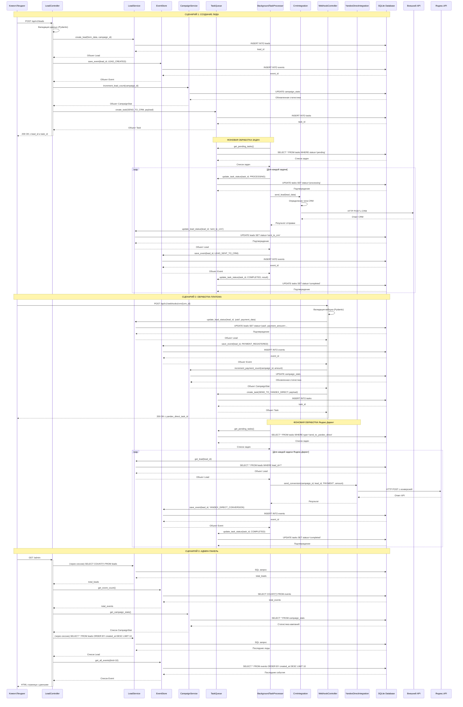

# Поток данных в приложении агрегатора

## Описание взаимодействий по классам:

### **LeadController** (HTTP контроллер)
- Принимает HTTP запросы на создание лидов
- Взаимодействует с:
  - `LeadService` для создания/получения лидов
  - `EventStore` для сохранения событий
  - `CampaignService` для обновления статистики
  - `TaskQueue` для создания фоновых задач

### **LeadService** (Бизнес-логика лидов)
- Содержит методы для работы с лидами
- Использует SQLModel для ORM операций
- Работает с таблицей `leads` в SQLite

### **EventStore** (Event Sourcing хранилище)
- Сохраняет все события системы
- Поддерживает восстановление состояния агрегатов
- Работает с таблицей `events` в SQLite

### **CampaignService** (Статистика кампаний)
- Считает лиды и платежи по кампаниям
- Обновляет таблицу `campaign_stats`
- Предоставляет данные для отчетов

### **TaskQueue** (Очередь задач)
- Создает и управляет фоновыми задачами
- Работает с таблицей `tasks` в SQLite
- Предоставляет задачи для обработки `BackgroundTaskProcessor`

### **BackgroundTaskProcessor** (Фоновый обработчик)
- Постоянный процесс, опрашивающий очередь задач
- Выполняет задачи асинхронно
- Обновляет статусы задач

### **CrmIntegration** (Интеграция с CRM)
- Отправляет лиды в различные CRM системы
- Поддерживает AmoCRM, Bitrix24, generic CRM
- Выполняет HTTP запросы к внешним API

### **WebhookController** (Обработчик вебхуков)
- Принимает вебхуки от CRM о платежах
- Обновляет статусы лидов
- Запускает задачи для Яндекс.Директ

### **YandexDirectIntegration** (Интеграция с Яндекс.Директ)
- Отправляет конверсии в Яндекс.Директ API
- Использует данные о платежах для отслеживания конверсий

### **SQLite Database** (База данных)
- Хранит все данные приложения:
  - `leads` - проекция лидов
  - `events` - события Event Sourcing
  - `tasks` - фоновые задачи
  - `campaign_stats` - статистика кампаний

## Ключевые особенности потока данных:

1. **Event Sourcing**: Все изменения сохраняются как события в таблице `events`
2. **Проекции**: Таблица `leads` представляет собой оптимизированную проекцию для быстрого доступа
3. **Фоновые задачи**: Длительные операции (отправка в CRM, Яндекс.Директ) выполняются асинхронно
4. **Статистика в реальном времени**: `campaign_stats` автоматически обновляется при каждом лиде/платеже
5. **Восстановление состояния**: Можно восстановить состояние любого лида по цепочке событий

Такая архитектура обеспечивает надежность, масштабируемость и простоту отладки системы.